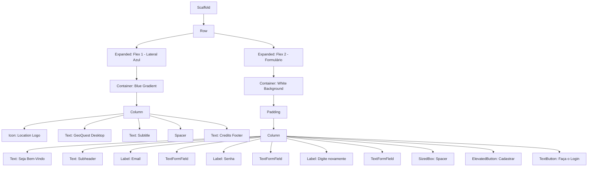

## Tela de Cadastro

A tela de cadastro mantém a consistência visual, expandindo o formulário para coleta de dados iniciais.

### Árvore de Componentes

```mermaid
  graph TD
      A[Scaffold] --> B[Row]

      B --> C[Expanded: Flex 1 - Lateral Azul]
      B --> D[Expanded: Flex 2 - Formulário]

      C --> C1[Container: Blue Gradient]
      C1 --> C2[Column]
      C2 --> C3[Icon: Location Logo]
      C2 --> C4[Text: GeoQuest Desktop]
      C2 --> C5[Text: Subtitle]
      C2 --> C6[Spacer]
      C2 --> C7[Text: Credits Footer]

      D --> D1[Container: White Background]
      D1 --> D2[Padding]
      D2 --> D3[Column]
      D3 --> D4[Text: Seja Bem-Vindo]
      D3 --> D5[Text: Subheader]
      D3 --> D6[Label: Email]
      D3 --> D7[TextFormField]
      D3 --> D8[Label: Senha]
      D3 --> D9[TextFormField]
      D3 --> D10[Label: Digite novamente]
      D3 --> D11[TextFormField]
      D3 --> D12[SizedBox: Spacer]
      D3 --> D13[ElevatedButton: Cadastrar]
      D3 --> D14[TextButton: Faça o Login]
```

---
